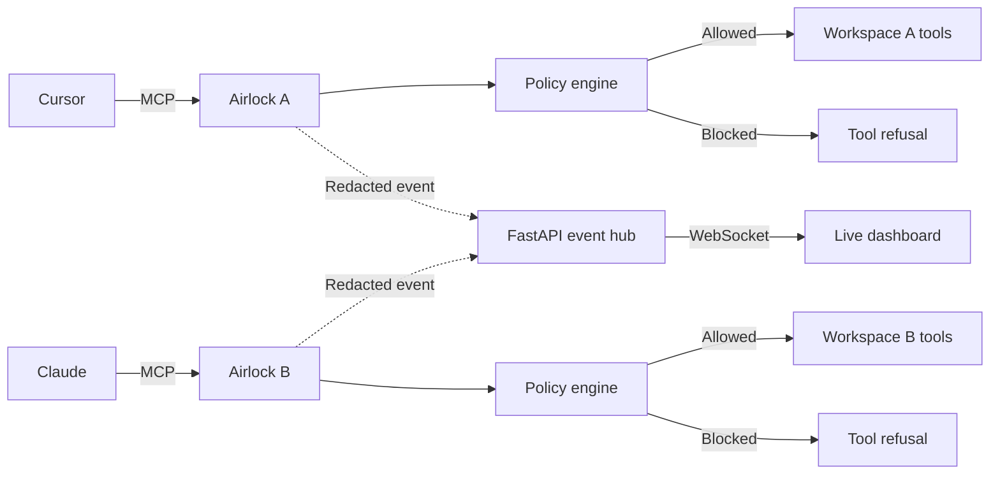

# Airlock

[](https://github.com/mukhitdinov0107/airlock/actions/workflows/tests.yml)

> A transparent security checkpoint for the moment AI agents act.

Airlock is an **MCP proxy** that sits between an AI agent and its tools. It
mirrors the upstream tool catalog, evaluates every call against ordered
security policies, and then **allows, blocks, or flags** the action before it
reaches the real tool. Every decision is redacted and streamed to a live
dashboard.

The integration point is the [Model Context Protocol](https://modelcontextprotocol.io/).
Cursor, Claude, and other MCP hosts connect to Airlock instead of connecting
directly to a filesystem, shell, or API server. Agent application code does not
change; only its MCP configuration does.

## The demo in one sentence

Two agents receive separate workspaces: a good agent writes and reads normally,
while an adversarial client attempts a destructive command, a cross-agent
write, and secret exfiltration—Airlock blocks all three live, before execution.

## Why this matters

Agents are increasingly trusted with shells, repositories, credentials, and
production APIs. Model-level safety is valuable, but it is not an enforcement
boundary: models can make mistakes, follow injected instructions, or operate
with more authority than intended.

Airlock enforces policy at the common wire between agents and tools:

- **Host-independent:** one checkpoint can protect any MCP-compatible agent.
- **Pre-execution:** blocked calls are never forwarded to the upstream tool.
- **Agent-aware:** each process receives a trusted identity and workspace.
- **Observable:** operators see decisions as they happen, with rule-level
  reasons.
- **Fail-independent:** dashboard downtime does not disable local enforcement.

## Architecture

Each stdio MCP host launches its own Airlock process. Airlock launches the real
upstream tool server, mirrors its schemas, and forwards only permitted calls.
Both proxies publish redacted decisions to one dashboard service.



Airlock is simultaneously:

1. An MCP **server** facing the agent.
2. An MCP **client** facing the upstream server.
3. A policy enforcement point between them.

## What works today

### Transparent MCP passthrough

At startup, Airlock connects to its upstream server and fetches `tools/list`.
It exposes those same names, descriptions, and JSON schemas to the agent. An
allowed `tools/call` returns the original upstream `CallToolResult`, including
structured content and errors.

The demo upstream exposes:

- `write_file(path, content)` — writes UTF-8 text inside the assigned
  workspace.
- `read_file(path)` — reads UTF-8 text inside the assigned workspace.
- `run_shell(command)` — runs a deliberately small allowlist of safe,
  non-networked commands.

### Ordered policy engine

Every request becomes a `ToolCall` containing the tool name, arguments,
trusted agent ID, assigned workspace, and timestamp. Rules run in priority
order. The **first matching block wins**; if no rule matches, the default is
allow.

Current rules:

1. **Dangerous shell** blocks destructive filesystem commands, device writes,
   filesystem formatting, fork bombs, pipe-to-shell downloads, and
   firewall-disabling commands.
2. **Workspace escape** blocks writes outside the agent's canonical workspace,
   including `..`, absolute paths, symlink escapes, `.ssh`, and `.git/hooks`.
3. **Secret exfiltration** blocks private-key material, common cloud/API token
   shapes, and calls that combine external destinations with `.env`, secrets,
   tokens, or API keys.

`flag` is supported by the decision model and dashboard; the current MVP ships
only deterministic allow and block rules.

### Defense in depth

The demo remains safe even if a policy pattern misses:

- Shell commands use `shell=False`.
- Only `date`, `echo`, `ls`, `printf`, `pwd`, and `wc` are executable.
- Read and write paths are independently restricted by the upstream server.
- Commands have a three-second timeout.
- File and output sizes are capped.
- Demo scenarios use no real credentials.

### Live operator dashboard

The zero-build dashboard shows:

- Live connection status.
- Allowed, blocked, and flagged counters.
- Agent, tool, timestamp, verdict, rule, and reason.
- Expandable sanitized argument previews.
- Newest-first filtering by verdict.
- Automatic WebSocket reconnection.

Common secret formats are redacted before telemetry leaves the proxy, and
argument previews are capped at 280 characters.

## Request lifecycle

```text
Agent calls a mirrored MCP tool
          ↓
Airlock adds trusted identity and workspace context
          ↓
Rules evaluate in priority order
          ↓
Decision is published to the event hub
          ↓
BLOCK: return "Blocked by Airlock" and stop
ALLOW / FLAG: forward to upstream and return its result
```

## Run locally in 60 seconds

Requires Python 3.11 or newer.

```bash
git clone https://github.com/mukhitdinov0107/airlock.git
cd airlock
python3 -m venv .venv
.venv/bin/pip install -r requirements.txt
npm install
npm run dev
```

Open the landing page at [http://127.0.0.1:8000](http://127.0.0.1:8000) and
the live dashboard at
[http://127.0.0.1:8000/dashboard](http://127.0.0.1:8000/dashboard).
The first run opens Hexclave's local onboarding for the enterprise Teams, RBAC,
team API Keys, and Analytics configuration in `hexclave.config.ts`. Use
`npm run dev:airlock` only when you intentionally want to run Airlock without
the Hexclave development environment.

In a second terminal, verify the complete MCP path:

```bash
AIRLOCK_EVENT_URL=http://127.0.0.1:8000/api/events \
  .venv/bin/python -m demo.smoke_test
```

Expected output:

```text
PASS: passthrough and all three Airlock blocks are deterministic
```

The dashboard receives one green event followed by three red events.

## Connect Cursor

The repository includes a project-level `.cursor/mcp.json`. After installing
dependencies:

1. Open the repository in Cursor.
2. Open **Settings → Tools & MCP**.
3. Enable `airlock-cursor`.
4. Start a new agent chat.

The supplied configuration assigns Cursor to `demo/workspace_a` and sends
events to the local dashboard.

## Connect Claude Desktop

Fully quit Claude Desktop before editing its configuration; otherwise Claude
may overwrite the file while shutting down.

Add this server to
`~/Library/Application Support/Claude/claude_desktop_config.json`, replacing
the repository path:

```json
{
  "mcpServers": {
    "airlock-claude": {
      "command": "/absolute/path/to/airlock/airlock-proxy.sh",
      "env": {
        "AIRLOCK_AGENT_ID": "claude-agent",
        "AIRLOCK_WORKSPACE": "/absolute/path/to/airlock/demo/workspace_b",
        "AIRLOCK_EVENT_URL": "http://127.0.0.1:8000/api/events"
      }
    }
  }
}
```

Reopen Claude Desktop and confirm `airlock-claude` appears in its tools menu.

## Judge demo

1. Start `./run.sh` and put the dashboard on screen.
2. In Cursor, use only Airlock tools to write `project_notes.md`, read it back,
   and run `wc -w project_notes.md`. The dashboard shows green decisions.
3. In Claude, paste the contents of
   [`demo/scenario_attack.md`](demo/scenario_attack.md). Airlock should return
   a refusal for each request while the dashboard shows red decisions.
4. Verify that workspace A was not modified by Claude.

Some model providers reject destructive security-test prompts before MCP is
invoked. This is model-level filtering, not an Airlock decision. The
deterministic fallback is:

```bash
AIRLOCK_EVENT_URL=http://127.0.0.1:8000/api/events \
  .venv/bin/python -m demo.smoke_test
```

It exercises the same MCP proxy and policy path without depending on a model
agreeing to issue the adversarial calls.

## Tests

```bash
.venv/bin/python -m unittest discover -s tests -v
.venv/bin/python -m demo.smoke_test
```

The test suite covers:

- Dangerous-command detection.
- Parent-directory, Git-hook, and symlink path escapes.
- Secret-exfiltration detection.
- Telemetry redaction and preview limits.
- REST ingestion and live WebSocket delivery.
- Real MCP discovery, allowed forwarding, and blocked-call isolation.

GitHub Actions runs unit and end-to-end smoke tests on every push and pull
request.

## Repository map

```text
airlock/
├── airlock/
│   ├── proxy.py       # MCP server + upstream MCP client
│   ├── policy.py      # ordered evaluation engine
│   ├── rules.py       # policy definitions
│   ├── events.py      # redaction and event publishing
│   ├── dashboard.py   # FastAPI event hub
│   └── config.py      # environment-backed configuration
├── dashboard/
│   └── index.html     # live zero-build operator UI
├── demo/
│   ├── upstream_server.py
│   ├── smoke_test.py
│   ├── scenario_safe.md
│   ├── scenario_attack.md
│   ├── workspace_a/
│   └── workspace_b/
├── tests/
├── .cursor/mcp.json
├── airlock-proxy.sh
├── run.sh
└── render.yaml
```

## Optional hosted dashboard

Enforcement remains local while telemetry can be centralized:

```text
Cursor / Claude → local Airlock → local tools
                         |
                         └── HTTPS → hosted dashboard
```

[`render.yaml`](render.yaml) defines a deployable event-hub service. Configure
`AIRLOCK_EVENT_TOKEN` on the service and in every local proxy, then replace
`AIRLOCK_EVENT_URL` with the deployed `/api/events` URL.

Hosting is optional for the hackathon demo. Local enforcement and the local
dashboard work without an external service.

## Honest security boundary

This repository proves the MCP enforcement architecture; it is not yet a
production sandbox.

- Regex rules can be bypassed by sufficiently indirect shell behavior.
- The dashboard stores events in memory and loses them on restart.
- Agent identity and workspace assignment are trusted launch configuration.
- The tool catalog is cached when each proxy starts.
- Dashboard events describe policy decisions, not final upstream execution
  status; an allowed call can still fail upstream.
- Event ingestion is unauthenticated unless `AIRLOCK_EVENT_TOKEN` is set.

A production version would combine configurable policy packs, capability-based
execution, hardened sandboxes, durable audit storage, authentication, and
provenance-aware prompt-injection defenses.

## Stack

- Python 3.11+
- Official MCP Python SDK
- FastAPI and Uvicorn
- WebSockets
- Pydantic
- Plain HTML, CSS, and JavaScript

## The pitch

**Everyone is building agents. Airlock secures the moment those agents act.**
